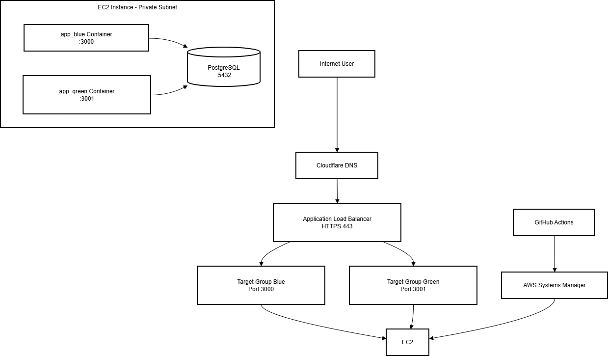

# Architecture Documentation

This document describes the infrastructure and traffic flow for the CredPal DevOps Assessment.

> **Note**: For security-specific details, see [security.md](security.md). For getting started, see the [root README](../README.md).

---

## High-Level Architecture



---

## Network Design

### VPC

A dedicated VPC isolates all application resources. The address space is divided into public and private subnets across availability zones.

### Public Subnets

- Houses the **Application Load Balancer**
- Connected to the **Internet Gateway** for inbound internet traffic
- No application workloads run here

### Private Subnets

- Houses the **EC2 instance**
- No direct inbound access from the internet
- Outbound internet access (for pulling images, AWS API calls) flows through the **NAT Gateway** placed in the public subnet

### Internet Gateway

Attached to the VPC to allow the ALB to receive traffic from the internet.

### NAT Gateway

Placed in a public subnet. Allows resources in private subnets (EC2) to initiate outbound connections without being directly reachable from the internet.

---

## Compute

### EC2 Instance

A single EC2 instance runs in the private subnet. It hosts three Docker containers managed by Docker Compose:

| Container | Port | Role |
|-----------|------|------|
| `app_blue` | 3000 | Blue deployment slot |
| `app_green` | 3001 | Green deployment slot |
| `postgres` | 5432 | PostgreSQL database (internal only) |

At rest, only one of `app_blue` or `app_green` is running. During a deployment both run briefly in parallel while health checks are performed and connections drain — after which the previously active container is stopped.

The instance has no SSH access. All remote operations are performed through **AWS SSM Session Manager**, enabled via an instance profile (IAM role attached to the instance).

---

## Load Balancer

The **Application Load Balancer (ALB)** sits in the public subnets and is the sole entry point for user traffic.

- **Port 80** — HTTP listener with a redirect rule to HTTPS
- **Port 443** — HTTPS listener with an ACM-managed TLS certificate; forwards to the active target group

Two target groups exist: one for `app_blue` (port 3000) and one for `app_green` (port 3001). During a deployment, the listener's default action is updated to point to the newly deployed target group.

ALB access logs are stored in a dedicated **S3 bucket**.

---

## Security Groups

| Resource | Inbound | Outbound |
|----------|---------|----------|
| ALB | 80, 443 from `0.0.0.0/0` | All |
| EC2 | Ports 3000, 3001 from ALB SG only | All |

The EC2 instance has no inbound rule for port 22. There is no bastion host. All operator access is via SSM.

---

## DNS and TLS

**Cloudflare** manages the domain. DNS records are provisioned by Terraform using the Cloudflare provider.

**ACM** issues a certificate for the application domain. Certificate validation is DNS-based and Terraform creates the required CNAME records in Cloudflare automatically (via `terraform/env/dns`). Once validated and in `ISSUED` state, the certificate is attached to the ALB HTTPS listener.

---

## IAM

IAM follows least-privilege principles throughout.

| Role / Principal | Purpose |
|------------------|---------|
| EC2 instance profile | SSM access, Secrets Manager read, ECR/DockerHub pull, ELBv2 describe/modify |
| GitHub Actions OIDC role | Short-lived credentials for CI — scoped to build, Terraform, and SSM send-command |

No long-lived access keys are used anywhere. GitHub Actions authenticates via **OIDC**, exchanging a signed JWT for a scoped AWS role session.

---

## State Management

Terraform remote state is stored in a dedicated **S3 bucket** with versioning enabled. Each environment (`dns`, `main`) uses its own state key.

---

## Deployment Flow

```
Deployment Flow
Developer opens PR
       │
       ▼
┌─────────────────────┐
│ Security Scan       │  SonarQube · Snyk · Checkov
│ Unit Tests          │  Jest
└────────┬────────────┘
         │ PR merged to main
         ▼
┌─────────────────────┐
│ Build               │  Docker build → Trivy scan → DockerHub push
└────────┬────────────┘
         │ on success (runs in parallel)
         ├─────────────────────┐
         ▼                     ▼
┌──────────────────────────┐   ┌──────────────────────────┐
│ Terraform Apply          │   │ Deploy via SSM           │
│                          │   │                          │
│ Detect and apply         │   │ · Skip if no new image   │
│ infrastructure changes   │   │ · Detect active env      │
│                          │   │ · Start inactive env     │
│                          │   │ · Health check           │
│                          │   │ · Switch ALB target      │
│                          │   │ · Drain + stop old       │
└──────────────────────────┘   └──────────────────────────┘
```

---

## Technology Summary

| Layer | Technology |
|-------|-----------|
| DNS | Cloudflare |
| TLS | AWS ACM |
| Load Balancer | AWS ALB |
| Compute | AWS EC2 (private subnet) |
| Containers | Docker, Docker Compose |
| Database | PostgreSQL (containerised) |
| IaC | Terraform |
| Configuration | Ansible |
| CI/CD | GitHub Actions |
| Secret Management | AWS Secrets Manager |
| Remote Access | AWS SSM |
| State Backend | AWS S3 |

---

## Related Documentation

- [← Back to README](../README.md)
- [security.md →](security.md)